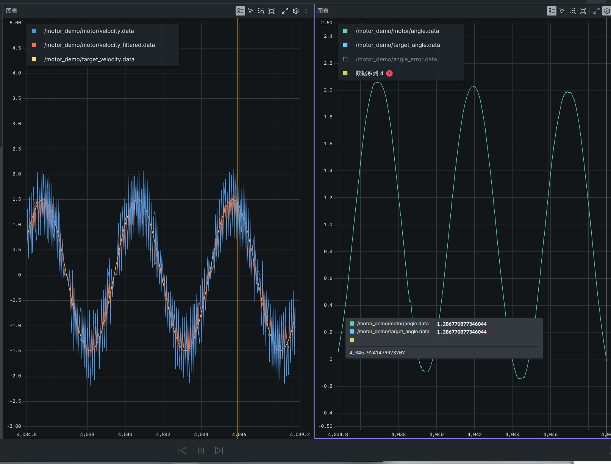

# RMCS 电机驱动作业

> 基于 [Alliance-Algorithm/RMCS](https://github.com/Alliance-Algorithm/RMCS)（RoboMaster 机器人控制框架 / ROS2）的个人作业仓库。
> 在保留官方框架的前提下，从硬件接入到双环控制完整实现并**真机验证**了两个电机驱动任务（**第二周任务**）。

## 目录

- [周次进度](#周次进度)
- [任务一览](#任务一览)
- [实验硬件](#实验硬件)
- [环境与快速开始](#环境与快速开始)
- [仓库结构](#仓库结构)
- [测试模式切换](#测试模式切换)
- [真机验证结果](#真机验证结果)
- [相关文档](#相关文档)

## 任务一览

| 任务 | 内容 | 状态 |
|---|---|---|
| 任务一 | 发射机构组件链路分析（只读分析 17mm/42mm 火力链路） | ✅ 完成 |
| 任务二 | **速度闭环**：目标速度 → 内环速度 PID → M3508 跟随；测速经中值+低通滤波 | ✅ 真机通过 |
| 任务三 | **双环控角度**：外部发角度 → 外环角度 PID → 内环速度 PID 串级 → 走**优弧**到位 | ✅ 真机通过 |

## 周次进度

| 周次 | 内容 | 状态 |
|---|---|---|
| 第二周 | 电机驱动任务：任务二·速度闭环 + 任务三·双环控角度（Foxglove 观测 / 中值+低通滤波 / 串级 PID / yaml A·B 测试模式） | ✅ 完成（真机验证通过） |
| 第三周 | 下一阶段任务 | 🚧 开发中 |

**演示效果（Foxglove 实采）**

**速度模式** · 速度方波 ±1.5 rad/s：黄=目标速度、蓝=原始测速、橙=滤波后贴住目标


**角度模式** · 目标角按正弦变化，实际角一路贴住目标角



## 实验硬件

- **主控**：CBoard（USB 串口，序列号在 `rmcs_ws/src/rmcs_bringup/config/test.yaml` 的 `board_serial` 配置）
- **电机**：M3508 ×1，CAN1 总线，拨码 id = 3（已开多圈角度、反向修正）
- **遥控**：DR16（已在 `test.cpp` 接入并发布 `/remote/joystick/*`；可选作「速度源·摇杆」= yaml 方案C，见[测试模式切换](#测试模式切换)。⚠️ **当前没有遥控器**，故方案 C 默认注释）
- **观测**：Foxglove WebSocket 桥（端口 8765），浏览器实时看曲线

## 环境与快速开始

开发环境使用官方 Dev Container（Docker）：

1. 克隆并安装依赖：
   ```bash
   git clone --recurse-submodules https://github.com/Alliance-Algorithm/RMCS.git
   code ./RMCS        # 然后选择 “Dev Containers: Reopen in Container”
   ```
2. 容器内构建：
   ```bash
   build-rmcs
   # 或只构建改动的两个包：
   cd rmcs_ws && colcon build --packages-select rmcs_core rmcs_bringup
   ```
3. 连接硬件后启动（robot:=test 加载 `test.yaml`）：
   ```bash
   cd /workspaces/RMCS/rmcs_ws && source install/setup.bash
   ros2 launch rmcs_bringup rmcs.launch.py robot:=test
   ```
4. 启动观测桥，浏览器打开 Foxglove（WebSocket 填 `ws://localhost:8765`）：
   ```bash
   ros2 run foxglove_bridge foxglove_bridge --ros-args -p port:=8765
   ```

> USB 设备号变动时执行 `bash /home/ubuntu/fix_usb.sh`；板子卡死需**断电重启板子主电源**（详见文档踩坑清单）。

## 仓库结构

```
rmcs_ws/src/rmcs_core/            # 本作业新增的源码（官方库仅动 plugins.xml 登记）
└── src/hardware/test.cpp                 MotorTest：CBoard + M3508 + DR16 硬件接入
└── src/controller/motor_demo/            任务软件组件
    ├── joystick_velocity_mapping.cpp     任务二·摇杆目标源
    ├── velocity_filter.cpp               任务二·测速 中值+低通 滤波
    ├── angle_target_controller.cpp       任务三·角度目标源（优弧误差 / 角度方波）
    └── command_mode_controller.cpp       yaml 速度/力矩波形目标源（免遥控压测）
└── src/filter/median_filter.hpp         中值滤波（自写，配合官方 LowPassFilter）

rmcs_ws/src/rmcs_bringup/config/test.yaml # 总接线：A(角度)/B(速度) 两套测试方案
docs/zh-cn/firing_mechanism_chain.md      # 完整说明：任务一分析 + 任务二/三教程
docs/zh-cn/assets/                        # 真机截图等
```

## 测试模式切换

全部测试只在 `test.yaml` 里切换（详细步骤见 [文档 §5](docs/zh-cn/firing_mechanism_chain.md)）：

| 想测 | 组件开关 | 参数段 |
|---|---|---|
| 角度·外部 `angle_cmd`（默认，安全） | 方案 A 开 | `motor_angle_target.angle_waveform: none` |
| 角度·方波压外环 | 方案 A 开 | `angle_waveform: square` + 外环 `motor_angle_pid_controller.kp/ki` |
| 速度·固定/方波/正弦 | 方案 B 开（注释 A 两行） | `motor_command_mode.mode: velocity, velocity_waveform: ...` |
| 速度·遥控摇杆(DR16) | 方案 C 开（注释 A 两行 + B 行）★需接遥控器 | `motor_joystick_mapping.max_velocity` |
| 力矩·直驱（开环⚠️） | 方案 B + 注释内环 PID 行 | `mode: torque, torque: 小值` |

> 遥控(DR16) 用法：`test.cpp` 已接入 DR16 并发布 `/remote/joystick/left`，`JoystickVelocityMapping` 组件已登记。要用手柄测任务二：yaml 里放开方案 C 那行即可；摇杆未连接/断连时该源输出 0（安全）。**当前无遥控器，方案 C 默认注释。**

## 真机验证结果

- **任务二（速度闭环）**：固定 2.0 / 方波 ±1.5 / 正弦 ±1.5 均能跟踪；外部 `velocity_cmd` 可实时覆盖；原始测速尖刺被中值滤波有效剔除。
- **任务三（双环角度）**：上电锁角不乱转；`angle_cmd 1.5 / -1.0` 均走优弧到位，`angle_error` 收敛到 ≈0；外环独立成 PID 块，可单独调 `kp/ki`（加 `ki` 收紧静态残差）。
- 安全默认 = 方案 A（锁角闭环，上电不飞转）。

## 相关文档

- [任务完整说明（任务一分析 + 任务二/三教程 + Foxglove 接口 + 踩坑）](docs/zh-cn/firing_mechanism_chain.md)
- [开发环境搭建（官方）](https://github.com/Alliance-Algorithm/RMCS/wiki/Quick-Start)
- [WSL2 开发指南](docs/zh-cn/wsl2_develop_guide.md)
- [镜像构建 / 交叉编译 / Docker 代理](docs/zh-cn/)

> 本仓库基于官方框架二次开发；官方完整文档与部署流程请见上游 [Alliance-Algorithm/RMCS](https://github.com/Alliance-Algorithm/RMCS)。
