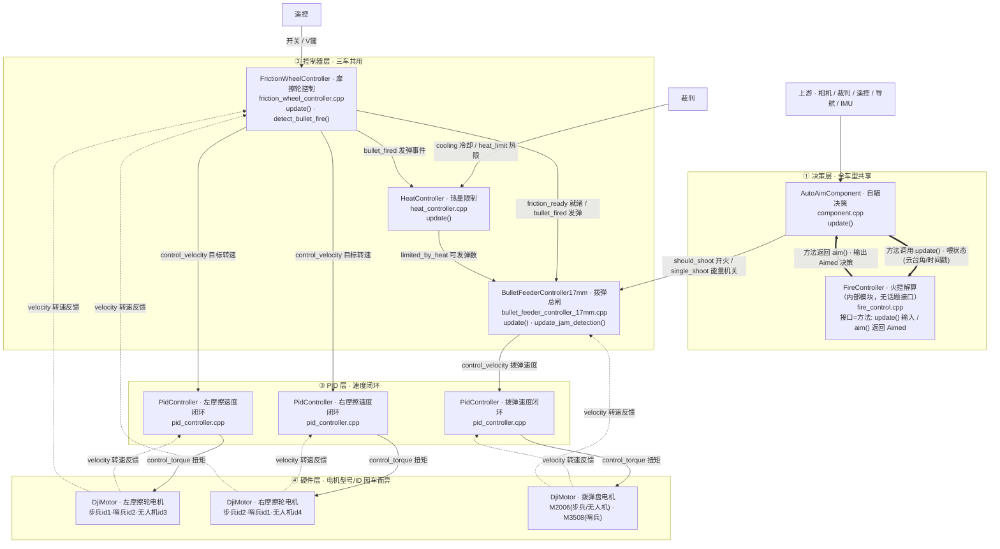
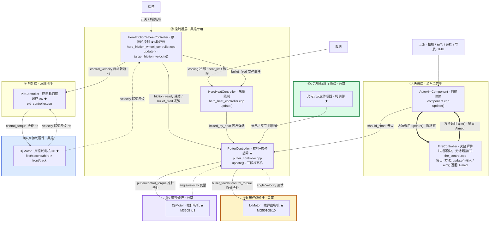
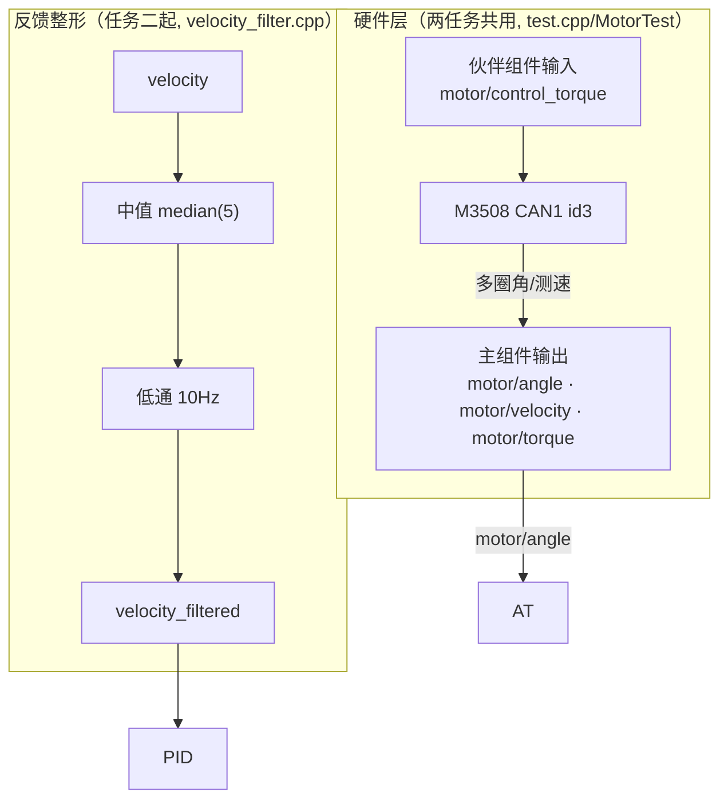
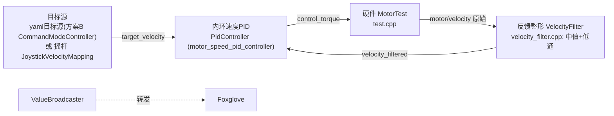
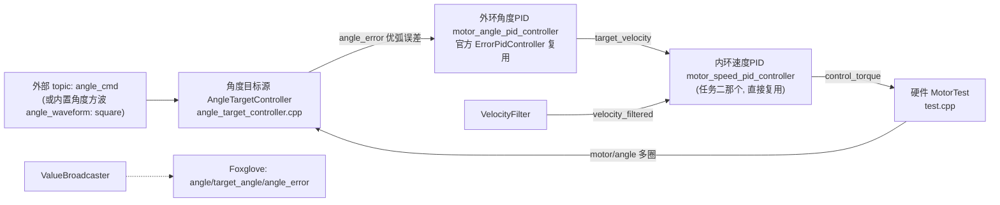

# 发射机构组件串联说明（17mm 共享体系 / omni-infantry）

> 目标：阅读有关发射机构的代码，画出发射机构的组件串联图。
> 本文以 17mm 步兵配置（`rmcs_bringup/config/omni-infantry.yaml`）为例，梳理"自瞄决策 → 发射控制器 → PID → 硬件 → 电机"的完整链路。
> 📌 **17mm 发射体系多车共享**（步兵/哨兵/无人机，控制器层同一套，仅硬件电机/CAN 不同）；**英雄是独立的 42mm 体系**。
> 两图**共享部分骨架一致**，差异以 `★` 轻标注；硬件层按兵种标注电机型号/ID 差异。
> 节点标注 **类名 · 中文概括 + 源文件 + 函数名**；连线标注**话题名（中文含义）**；`==>` 粗线表示**方法调用**（非话题接口）。

---

## 1. 总体结构：四层串联

| 层级 | 路径 | 作用 |
|---|---|---|
| ① 决策层 | `rmcs_auto_aim_v2/src/component.cpp` + `kernel/fire_control.cpp` | 判定是否开火，输出 `should_shoot`（全车型共享） |
| ② 控制器层 | `rmcs_core/src/controller/shooting/` | 摩擦轮 / 热量 / 上弹(拨弹·推杆) |
| ③ PID 层 | `rmcs_core/src/controller/pid/` | 速度指令 → 扭矩 |
| ④ 硬件层 | `rmcs_core/src/hardware/` | 扭矩 → CAN 帧 → 电机 |

**接线机制**：`register_output(topic)` 出、`register_input(topic)` 进，**话题名一致**即完成串联。

---

## 2. 组件串联图

> 📌 **说明**：`FireController`（火控）是 `AutoAimComponent` 内部的纯 C++ 类，**没有话题接口**（不 `register_input/output`）。它的输入输出靠**方法调用**：`fire->update(State)` 喂入云台/目标状态，`fire->aim(Trackable) → Aimed` 返回瞄准与开火决策（`should_shoot` 由此产生）。图中用 `==>` 粗线表示这类**方法调用**，与话题连线区分。

### 图A · 17mm 共享体系（步兵 / 哨兵 / 无人机）




### 图B · 42mm 英雄体系（★ 为与 17mm 不同处 · 硬件拆四组）




> **图例**：实线 `-->` = 话题指令/数据流；虚线 `-.->` = 话题反馈；**粗线 `==>` = 方法调用（非话题）**；`★` = 英雄与 17mm 的不同处。
> 英雄硬件拆四组（各配色）：**④a 摩擦轮**（蓝）· **④b 拨弹盘**（橙）· **④c 光电/灰度**（绿）· **④d 推杆**（紫）。
> ⚠️ **英雄两个"不接"**：`single_shoot`（rune 标志）与 `friction_profile_1_active` 都**不会**进 `PutterController`（后者仅供调试/UI 观察）——见 §2.2。
> 源码见 `mermaid/figA_17mm_shared.mmd`、`mermaid/figB_42mm_hero.mmd`。

---

## 2.1 各兵种发射机构差异速查

**控制器层**：17mm 三车（步兵/哨兵/无人机）完全一致；英雄独立。

| 部分 | 步兵 / 哨兵 / 无人机（图A） | 英雄 42mm（图B） |
|---|---|---|
| 决策层 | `AutoAimComponent`（自瞄决策）+ `FireController`（火控解算，内部模块） | 相同 |
| 摩擦轮控制器 | `FrictionWheelController`（摩擦轮控制，2 轮/单速） | `HeroFrictionWheelController` ★（摩擦轮控制，6 轮/双速档 F 键） |
| 热量控制器 | `HeatController`（热量限制） | `HeroHeatController`（热量限制） |
| 上弹控制器 | `BulletFeederController17mm`（拨弹总闸） | `PutterController` ★（推杆+拨弹总闸，三段状态机+光电/灰度） |
| PID | 3 个速度闭环 | 6 个速度闭环 + 内置拨弹/推杆 PID |
| 硬件 | 3 电机 | 8 电机 + 2 传感器（拆四组：④a 摩擦轮 / ④b 拨弹盘 / ④c 光电灰度 / ④d 推杆） |
| 自瞄输入 | `should_shoot` + `single_shoot(rune)` | **仅 `should_shoot`**（不接 rune） |

**17mm 三车硬件差异（小标注）**：

| 车型 | 左摩擦轮 | 右摩擦轮 | 拨弹盘 | 备注 |
|---|---|---|---|---|
| 步兵（全向） | M3508 id1 | M3508 id2 | M2006 id2 | `omni_infantry.cpp` |
| 步兵（变形） | M3508 id1 | M3508 id2 | M2006 id3 | `deformable-infantry-omni(-b).cpp` |
| 哨兵 | M3508 id2 | M3508 id1（反转） | **M3508 id4** | `sentry.cpp` |
| 无人机 | M3508 id3 | M3508 id4 | M2006 id1 | `flight.cpp` |

> 三者话题名**完全一致**（`/gimbal/left_friction`、`/gimbal/right_friction`、`/gimbal/bullet_feeder`），只是电机型号/ID/CAN 不同 → **控制器与电机解耦**。

---

## 2.2 接口一一对应总表（话题 ↔ 生产者 ↔ 消费者）

### 17mm 共享体系（三车相同）

| 话题 | 生产者（文件 / 类 / 成员 / 函数） | 消费者（文件 / 类 / 成员） |
|---|---|---|
| `/gimbal/auto_aim/camera_frame` | `AutoAimCapturer` | `AutoAimComponent::camera_frame`(Event) |
| `/referee/id` | `referee/status.cpp` | `AutoAimComponent::robot_id` |
| `/remote/switch/right\|left` | 遥控 `DR16` | `AutoAimComponent::rswitch/lswitch`、`FrictionWheelController::switch_right_/left_`、`BulletFeederController17mm::switch_right_/left_` |
| `/remote/mouse` | 遥控 `DR16` | `AutoAimComponent::mouse`、`BulletFeederController17mm::mouse_` |
| `/remote/keyboard` | 遥控 `DR16` | `AutoAimComponent::keyboard`、`FrictionWheelController::keyboard_`、`BulletFeederController17mm::keyboard_` |
| `/auto_aim/should_shoot` | `AutoAimComponent::should_shoot`（`fire->aim()`） | `BulletFeederController17mm::should_shoot_`、`PutterController::should_shoot_` |
| `/auto_aim/single_shoot` | `AutoAimComponent::single_shoot`（= `track_rune`） | `BulletFeederController17mm::single_shoot_`（**英雄不接**） |
| `/referee/shooter/cooling` | `referee/status.cpp` | `HeatController::shooter_cooling_`、`HeroHeatController::shooter_cooling_` |
| `/referee/shooter/heat_limit` | `referee/status.cpp` | `HeatController::shooter_heat_limit_`、`HeroHeatController::shooter_heat_limit_` |
| `/gimbal/friction_ready` | `FrictionWheelController::friction_ready_`（`update_friction_status()`） | `BulletFeederController17mm::friction_ready_`、`PutterController::friction_ready_` |
| `/gimbal/bullet_fired` | `FrictionWheelController::bullet_fired_`（`detect_bullet_fire()`） | `BulletFeederController17mm::bullet_fired_`、`HeatController::bullet_fired_`、`HeroHeatController::bullet_fired_`、`PutterController::bullet_fired_` |
| `/gimbal/control_bullet_allowance/limited_by_heat` | `HeatController::control_bullet_allowance_`（`update()`） | `BulletFeederController17mm::control_bullet_allowance_limited_by_heat_`、`PutterController::control_bullet_allowance_limited_by_heat_` |
| `/gimbal/{left,right}_friction/velocity` | `DjiMotor::velocity_output_`（`update_status()`） | `FrictionWheelController::friction_velocities_[i]`、`PidController::measurement_` |
| `/gimbal/{left,right}_friction/control_velocity` | `FrictionWheelController::friction_control_velocities_[i]` | `PidController::setpoint_` |
| `/gimbal/{left,right}_friction/control_torque` | `PidController::control_` | `DjiMotor::control_torque_` |
| `/gimbal/bullet_feeder/velocity` | `DjiMotor::velocity_output_` | `BulletFeederController17mm::bullet_feeder_velocity_`、`PidController::measurement_` |
| `/gimbal/bullet_feeder/control_velocity` | `BulletFeederController17mm::bullet_feeder_control_velocity_` | `PidController::setpoint_` |
| `/gimbal/bullet_feeder/control_torque` | `PidController::control_` | `DjiMotor(拨弹)::control_torque_` |
| `/gimbal/shooter/mode` | `BulletFeederController17mm::shoot_mode_` | 调试/上层 |

### 42mm 英雄体系（★ 英雄专属）

| 话题 | 生产者（文件 / 类 / 成员） | 消费者（文件 / 类 / 成员） |
|---|---|---|
| `/gimbal/friction_profile_1_active` ★ | `HeroFrictionWheelController::friction_profile_1_active_` | **仅供调试/UI**（`PutterController` 不接） |
| `/gimbal/{first,second,third}_{front,back}_friction/velocity` ★ | `DjiMotor::velocity_output_` | `HeroFrictionWheelController::friction_velocities_[i]`、`PidController::measurement_` |
| `/gimbal/{first,second,third}_{front,back}_friction/control_velocity` ★ | `HeroFrictionWheelController::friction_control_velocities_[i]`（`target_friction_velocity()`） | `PidController::setpoint_` |
| `/gimbal/{first,second,third}_{front,back}_friction/control_torque` ★ | `PidController::control_` | `DjiMotor::control_torque_` |
| `/gimbal/bullet_feeder/angle` / `/velocity` ★ | 硬件 `LkMotor MG5010Ei10` | `PutterController::bullet_feeder_angle_` / `bullet_feeder_velocity_` |
| `/gimbal/bullet_feeder/control_torque` ★ | `PutterController::bullet_feeder_control_torque_`（内置 `bullet_feeder_velocity_pid_`） | `LkMotor(拨弹)::control_torque_` |
| `/gimbal/putter/angle` / `/velocity` ★ | 硬件 `DjiMotor putter_motor_` | `PutterController::putter_angle_` / `putter_velocity_` |
| `/gimbal/putter/control_torque` ★ | `PutterController::putter_control_torque_`（`putter_return_velocity_pid_`） | `putter_motor_::control_torque_` |
| `/gimbal/photoelectric_sensor` / `/gimbal/grayscale_sensor` ★ | 硬件传感器 | `PutterController::photoelectric_sensor_status_` / `grayscale_sensor_status_` |
| `/gimbal/shooter/preloaded_ready` ★ | `PutterController::preloaded_ready_` | 上层/调试 |
| `/gimbal/shooter/condiction` ★ | `PutterController::shoot_condiction_` | 上层/调试 |
| `/gimbal/shoot/delay_ms` ★ | `PutterController::shoot_delay_ms_` | 调试 |
| `/shoot/heat` ★ | `HeroHeatController::shooting_heat_` | 调试 |

---

## 3. 发射流程（大白话）

**17mm**：自瞄判定开火 → 拨弹总闸确认（摩擦轮就绪 + 热量余额 + 遥控允许）→ 拨弹盘 20Hz 上弹 → 摩擦轮 660rpm 射出 → `bullet_fired` 反馈（单发停止 + 热量累计）。

**英雄 42mm**：先预装填（推杆复位 → 拨弹上膛 → 光电/灰度确认 → `PRELOADED`）→ 触发（自瞄 `should_shoot` + 手动/自动/双击）→ 推杆上膛射击 → 反馈。

---

## 4. 关键机制（函数对照）

| 机制 | 代码要点 |
|---|---|
| 软启停 | `friction_wheel_controller.cpp`：`update_friction_velocities()` |
| 发弹检测 | `friction_wheel_controller.cpp`：`detect_bullet_fire()` |
| 堵转检测 | `friction_wheel_controller.cpp`：`detect_friction_faulty()` |
| 卡弹保护 | 17mm：`update_jam_detection()`；英雄：`PutterController::update_putter_jam_detection()` |
| 热量限制 | `heat_controller.cpp` / `hero_heat_controller.cpp`：`update()` |
| 射击窗口 / 预瞄 / 退化 | `fire_control.cpp`：`ShootEvaluator::evaluate()`、`evaluate_armor()`、`get_attack_window()` |
| 双速度档 ★ | `hero_friction_wheel_controller.cpp`：`active_profile_` / `target_friction_velocity()` |
| 三段状态机 ★ | `putter_controller.cpp`：`set_preloading()/set_preloaded()/set_shooting()` |

---

## 5. 各机器人发射机构一览

| 车型 | 配置 yaml | 硬件层 | 摩擦轮 | 拨弹/上弹 |
|---|---|---|---|---|
| 步兵（全向） | `omni-infantry.yaml` | `omni_infantry.cpp` | M3508 id1/id2 | M2006 拨弹 |
| 步兵（变形） | `deformable-infantry-omni(-b).yaml` | `deformable-infantry-omni(-b).cpp` | M3508 id1/id2 | M2006 id3 拨弹 |
| 哨兵 | `sentry.yaml` | `sentry.cpp` | M3508 id2/id1 | **M3508 id4** 拨弹 |
| 无人机 | `flight.yaml` | `flight.cpp` | M3508 id3/id4 | M2006 id1 拨弹 |
| 英雄 | `steering-hero-little-six-friction.yaml` | `steering-hero-little-six-friction.cpp` | **M3508 ×6** | **LkMotor 拨弹 + M3508 推杆** |

> 哨兵拨弹用 M3508（非 M2006）但控制器仍是 `BulletFeederController17mm` → **控制器与电机解耦**。

---

## 6. 三条"暗线"

1. **`bullet_fired` 一分为多**：喂上弹控制器（单发停止）+ 热量控制器（累计热量）(+ 英雄 `PutterController`)。
2. **`friction_ready` 是总闸前提**：摩擦轮未就绪不给 allowance。
3. **`single_shoot` 是 rune 标志**（= `track_rune`），且**只有 17mm 拨弹控制器消费**，英雄 `PutterController` 不接。

---

## 7. 自验证方法

每组件看四处：`register_input`（上游）、`register_output`（下游）、`update()`（逻辑）、`get_parameter`（参数）。
**串联判定**：上家输出话题名 = 下家输入话题名，且数据类型一致。

---


---

# 电机驱动任务教程（任务二：速度闭环 → 任务三：双环控角度）✅ 均已完成并真机验证

> 本部分与上面的「任务一·发射机构链路分析」相互独立，专注**自己动手做的电机驱动 demo**：
> 从「摇杆/指令让电机**转**（速度闭环）」做到「发一个**角度**，电机沿**优弧**自动到位（双环）」，最后收敛成一份**可一键切换测试模式的 yaml**。
>
> - 实验台：CBoard(USB 串口) + M3508(CAN1, id=3, 已开多圈) + DR16 遥控。任务二早期用遥控摇杆当目标源，之后为「免遥控、可重复压测」把目标源改成 **yaml/外部 topic 驱动**（见 §5 方案 B）。
> - 改动范围：**官方库只动 `plugins.xml`（登记新组件，框架必需）**；其余全部为新增文件，清单见 §1。
> - 本文所有命令默认工作目录：`cd /workspaces/RMCS/rmcs_ws && source install/setup.bash`。

## 0. 先懂 3 个概念（读代码的前提）

1. **一个组件 = 一个 C++ 类**（继承 `rmcs_executor::Component` + `rclcpp::Node`）。executor 按固定 `update_rate`(我们设 1000Hz=1ms) 调每个组件的 `update()`。
2. **组件之间靠「同名话题」连接**：`register_output("/xxx", var_)` 发布、`register_input("/xxx", var_)` 订阅，同名即自动连通。
   ⚠️ 这些是**进程内**话题（不走 ROS2/DDS 网络）——所以 `ros2 topic`、Foxglove **默认看不到**，必须靠 `ValueBroadcaster` 桥到 ROS2（见 §2）。
3. **复用**：RMCS 仓库现成的 PID / 滤波 / 遥控 / 广播器直接接线，不重写。官方组件只加进 yaml，不碰它的源码。

> 一个小约定：executor 用 yaml 里 `xxx -> 组件别名` 实例化；每个组件自己的参数块也用**同一个别名**命名（如 `motor_speed_pid_controller:` 段）。改参数 = 改 yaml 里对应段，**不需要动 C++**。

## 1. 我新增/改动了哪些文件（全清单 + 在链路里的角色）

| 文件 | 新增/改动 | 是什么 / 链路角色 | 属于 |
|---|---|---|---|
| `rmcs_core/src/hardware/test.cpp` | 新增(我方) | 硬件组件 `MotorTest`：CBoard+M3508(CAN1,id3)+DR16。仿官方 omni 文件「主/伙伴组件」拆法：**输出** angle/velocity 注册在主件、**输入** control_torque 注册在伙伴件 → executor 拓扑排成「收→算→发」不成环 | 任务二+三 |
| `rmcs_core/src/controller/motor_demo/joystick_velocity_mapping.cpp` | 新增(我方) | 任务二「人肉目标源」：左摇杆 y×max → `/target_velocity`；摇杆断连输出 0（安全）。后被 yaml 目标源替代做自动测试 | 任务二(原始) |
| `rmcs_core/src/controller/motor_demo/velocity_filter.cpp` | 新增(我方) | **反馈整形**：中值(砍尖刺)+低通(平滑) 串联 → `/motor_demo/motor/velocity_filtered`，给内环 PID 当测量 | 任务二 |
| `rmcs_core/src/filter/median_filter.hpp` | 新增(我方) | 滤波器：滑动窗口排序取中值，专砍测速「位置差分」产生的量化尖刺；`median_window`(奇数) | 任务二扩展 |
| `rmcs_core/src/controller/motor_demo/angle_target_controller.cpp` | 新增(我方) | 任务三「角度目标源」：收外部 `/angle_cmd` → 算**优弧误差** `/angle_error`；广播**抬升目标角** `/target_angle` 供叠图；可开内置角度方波 `angle_waveform: square` 压测外环 | 任务三 |
| `rmcs_core/src/controller/motor_demo/command_mode_controller.cpp` | 新增(我方) | **yaml 波形目标源(方案B)**：velocity 出固定/方波/正弦 v(t)；可被外部 `velocity_cmd`/`torque_cmd` 覆盖。不做角度（角度归任务三外环，避免双写 target_velocity） | 扩展 |
| `rmcs_bringup/config/test.yaml` | 新增(我方) | **总接线图**：组件列表 + 每组件参数块 + A/B 两套测试方案 + ValueBroadcaster 桥 | 任务二/三 |
| `rmcs_core/plugins.xml` | 改动(**官方唯一**) | 登记上述新组件类（pluginlib 加载必需，不加就 `class not found`） | 任务二/三 |

**复用的现成组件（没重写源码，只在 yaml 接线）**：`PidController`（内环速度 PID）、`ErrorPidController`（外环角度 PID）、`filter::LowPassFilter`、`broadcaster::ValueBroadcaster`（进程内→ROS2 桥）、`device::RemoteControl`/`Dr16`。

**一张图看两任务的共用资源与差别**：



## 2. 怎么「看见」数据：找 Foxglove 接口（两任务通用，先学会）

目标：在浏览器里实时看 `velocity / velocity_filtered / target_velocity / angle / target_angle / angle_error` 这些曲线（本文两张截图就是这么截的）。

### 2.1 为什么默认看不到？
`register_output/register_input` 是**executor 进程内**话题。要让它们出现在 ROS2 网络上，需要 `ValueBroadcaster`：yaml 里它的 `forward_list` 写了哪些内部话题，它就原样转发成同名 ROS2 话题（`/motor_demo/motor/velocity` 等）。⚠️ 想加新观测话题 → 改 `forward_list` → 重启 executor。

### 2.2 启动桥（bridge）
桥是普通 ros2 节点（foxglove_bridge），必须先 `source` 再跑（开发容器 `network_mode: host`，容器=宿主网络，端口直接通）：

```bash
cd /workspaces/RMCS/rmcs_ws && source install/setup.bash
ros2 run foxglove_bridge foxglove_bridge --ros-args -p port:=8765
```

### 2.3 浏览器里连（接口地址）
1. 打开 Foxglove：桌面 App，或网页版 `https://app.foxglove.dev`（本教程用网页版）。
2. 主页 → **Open connection / Data source** → 选 **Foxglove WebSocket**。
3. 地址填：`ws://localhost:8765` → Connect。
4. 左边 Topic 列表会看到 `/motor_demo/*` 一大串——在列表里搜 `velocity` / `angle` 即可。Foxglove 会把主题显示成 `…/velocity_data`、`…/target_angle_data` 这种带 `_data` 的名字，**选它就是要的那条**。
5. 新建 **Plot(折线图)** 面板 → 把想要的主题拖进去即可多线叠图。

### 2.4 叠图看什么（每条 demo 的标准视图）
| 想验证 | 把这几条叠一张图 | 期望 |
|---|---|---|
| 速度闭环跟踪 | `motor/velocity` + `motor/velocity_filtered` + `target_velocity` | 黄目标方波/正弦，橙色滤波速度**贴住**目标；蓝色原始速度围着橙线抖（这就是滤波的功劳） |
| 测速滤波效果 | `motor/velocity` vs `motor/velocity_filtered` | 蓝毛刺大，橙平滑 |
| 角度到位 | `motor/angle` + `target_angle`（+另开一窗 `angle_error`） | 绿=实际、蓝=目标，到位后**重合**；误差窗收敛到 ≈0 |
| 力矩 | `motor/torque`（+`control_torque`） | 开环直驱看输出是否给到 |

> Foxglove 常见坑：端口 8765 开着但列表空/旧 → bridge 进程是**假死**（进程在、DDS 会话已脱离当前图），`pkill -f foxglove_bridge` 后重新跑 2.2 即可。别用 8766（其他服务占着）。

## 3. 任务二：速度闭环（让电机「听话地转」）

### 3.1 目标与验收
- 目标：给一个「目标速度」，电机实际转速追上去；把脏测速滤干净再喂 PID。
- 验收：目标方波 ±1.5 rad/s，滤波后实际速度能**贴住**目标翻转；原始测速的偶发尖刺被滤掉。

### 3.2 工程文件链路（速度闭环就这 5 个文件在跑）

- 文件↔角色：`test.cpp`(被控对象) + 目标源(谁定速度) + `velocity_filter.cpp`(反馈整形) + 官方 `PidController`(核心控制器) + `test.yaml`(接线) + `plugins.xml`(登记)。
- 各文件关键接线（见 §1 表）：目标源出 `target_velocity` → 内环 PID 的 `setpoint`；`velocity_filtered` 是 PID 的 `measurement`；PID 出 `control_torque` 给电机。

### 3.3 开发思路（为什么这么做）
1. **先让硬件能动**：MotorTest 是照官方 omni 硬件文件骨架抄的（主/伙伴组件解环是 RMCS 固定套路），先把 `ros2 topic echo /motor_demo/motor/*` 能看到反馈、`control_torque` 能驱动当目标。
2. **内环速度闭环是「地基」**：先调 `PidController`(内环)。kp 太小电机推不动(实测 0.02 基本不动 → 0.4 跟手)；加 ki 消静摩擦残留；转向反了改 `test.cpp` 里 `.set_reversed()`。
3. **为什么要「中值+低通」两级滤波**：M3508 测速本质是「位置差分」，量化后偶发**尖刺**（会瞬间让 PID 疯狂输出）；先中值(5)把离群尖刺整根剔除，再低通(10Hz)把剩余毛刺抹平 → `velocity_filtered` 又干净又没相位大滞后。
4. **为什么滤速度不滤角度**：测速是差分量噪声大所以必须滤；**角度是绝对读数**，很干净，滤了反而加滞后、任务三角度环会变肉。
5. **目标源为什么要从「摇杆」升级成「yaml 波形」**：摇杆验证靠手推不可重复；改成 `CommandModeController` 后目标速度可以是**固定/方波/正弦**，用脚本就能复现同一激励压测内环（还能证明任意 v(t) 都能跟踪）。遥控没连也不再是障碍。

### 3.4 yaml 里怎么切到这个测试（= 方案 B · velocity）
切法逐字说明见 §5「模式切换大全」。核心两步：
1. `components`：注释【方案A】两行、放开 `CommandModeController` 那行；
2. `motor_command_mode` 段：`mode: velocity`，`velocity_waveform: square/sine/none` 选激励。
然后 `colcon build --packages-select rmcs_bringup`（只改了 yaml 也得重编一次把它拷进 install）→ `ros2 launch rmcs_bringup rmcs.launch.py robot:=test`。

### 3.5 实测截图（任务二·速度模式）
**速度模式 · 速度方波 ±1.5 rad/s**（黄=`target_velocity` 台阶、蓝=`velocity` 原始抖动、橙=`velocity_filtered` 平滑贴住；右图为速度模式下 `angle`/`target_angle` 占位重合，**非角度控制**）：


> 印证：原始测速尖刺(瞬时 ~3.4)在滤波后只剩 ~1.13 的平滑段 → 中值+低通有效；滤波速度贴住目标 → 内环带宽够。

## 4. 任务三：双环控角度（发角度 → 走优弧到位）

### 4.1 目标与验收
- 目标：外部发一个**角度**（可多圈连续），电机沿**优弧（短弧）**自动转到并稳住。
- 验收：上电**锁当前角**不乱转；`angle_cmd 1.5` → 走优弧到位、`angle_error→0`；再发负数能走短弧回来；全程多圈不绕远路。

### 4.2 工程文件链路（在任务二上「外挂」一层角度环）

- 新增的只有角度那一层：`angle_target_controller.cpp`（目标源+算优弧误差）+ 一个**独立外环 PID 块**（yaml 里 `motor_angle_pid_controller`，复用官方 `ErrorPidController`）。内环、滤波、硬件全部复用任务二——这就是**串级**：外环出「目标速度」，内环把实际速度追上去。

### 4.3 开发思路（为什么这么做）
1. **必须先开多圈** `enable_multi_turn_angle()`：单圈角在 2π↔0 会跳变，角度环会「追着绕一整圈」甚至绕圈不稳；开多圈后角度是连续累加的真值。
2. **走优弧 = 角度差卷绕到 [−π,π)**：`误差 = std::remainder(目标 − 当前, 2π)`。这样从 350° 去 10° 会走 +20° 短弧而不是 −340° 绕远路。
3. **锁当前角**：没收到指令时目标=当前角 → 上电安全不乱转（这也是默认档开机就是「锁定」的原因）。
4. **为什么外环要拆成独立 PID 块**：角度环是串级的**外环**，它跟内环一样要单独调 `kp/ki/kd`。藏进别的组件里就「不能独立调、还臃肿」；拆成 `motor_angle_pid_controller` 独立块后，调角度环 = 改这一个块的参数，跟调内环完全一个手感，测试模式也更好切换（§5）。
5. **广播「抬升的」target_angle 而不是原始目标**：多圈累计后直接广播目标角会差「整数圈 2π」，Foxglove 里看着像永远没追上（假象）。所以广播 `当前角 + 卷绕误差` = 电机实际要去的那一格连续位置，与 `angle` 叠图直接重合（右下图那种重合 = 到位）。
6. **用角度方波压测外环**：让目标角在 0.5↔1.5 rad 自动翻转（`angle_waveform: square`），不用手发指令就能反复压外环；实测纯 P 到位留 ~0.1 rad 静差（P 特性+静摩擦）→ 给外环加 `ki≈0.2` 收紧。

### 4.4 yaml 里怎么切到这个测试（= 方案 A · angle）
1. `components`：放开【方案A】两行（`AngleTargetController` + 外环 `ErrorPidController`）、注释 `CommandModeController` 那行；
2. `motor_angle_target` 段：`angle_waveform: none`（听外部 `angle_cmd`）或 `square`（角度方波压测外环）；
3. `motor_angle_pid_controller` 段：调外环 kp/ki/kd、`output_min/max`(=限目标速度)、`integral_min/max`。

### 4.5 验证命令（真机已跑）
```bash
# 上电默认 = 锁定：error 应 ≈ 0
ros2 topic echo /motor_demo/angle_error --once
# 发目标角 1.5 rad，走优弧到位
ros2 topic pub -1 /motor_demo/angle_cmd std_msgs/msg/Float64 "{data: 1.5}"
# 再看已到位（angle≈1.5、error≈0），发 -1.0 走短弧回来
ros2 topic pub -1 /motor_demo/angle_cmd std_msgs/msg/Float64 "{data: -1.0}"
```

### 4.6 实测截图（任务三·角度模式）
**角度模式 · 目标角正弦跟踪**（外部按正弦发 `angle_cmd`：右图 `angle`(绿) 与 `target_angle`(蓝) **贴合**、`angle_error` 收敛在 0 附近；左图蓝=电机转速、橙=`velocity_filtered`、黄=外环给出的 `target_velocity`）：


## 5. test.yaml 测试模式切换大全（速查）

> 全部测试 = 在 `test.yaml` 的 `components:` 里**注释/放开 3 行** + 改对应参数段。改完 `colcon build --packages-select rmcs_bringup` 再重启 executor（Ctrl+C 优雅停，别 kill -9）。

| 想测什么 | components 怎么动 | 改哪个参数段 | 看哪条曲线 |
|---|---|---|---|
| **角度·外部 angle_cmd**（默认档，安全） | 放开 A 两行 / 注释 B 行 | `motor_angle_target.angle_waveform: none` | angle 追 target_angle，angle_error→0 |
| **角度·方波压外环** | 同上 | `motor_angle_target.angle_waveform: square`(+low/high/半周期) + `motor_angle_pid_controller.kp/ki` | 同上，目标自动翻 |
| **速度·固定** | 放开 B 行 / 注释 A 两行 | `motor_command_mode.mode: velocity, velocity_waveform: none, velocity: 2.0` | velocity_filtered 贴 target_velocity |
| **速度·方波/正弦** | 同上 | `velocity_waveform: square/sine` + `waveform_amplitude/frequency_hz` | 同上，目标形状自选 |
| **速度·外部覆盖** | 同上 | `velocity_waveform: none`（覆盖只在 none 生效） | 发 `velocity_cmd` 实时改目标 |
| **力矩·直驱(开环!)** | 放开 B 行 **且注释内环 PID 行** | `motor_command_mode.mode: torque, torque: 0.3` | motor/velocity 持续加速=开环表现 |

要点/坑：
- **A/B 不能同时开**：方案A 外环和方案B 源都会写 `target_velocity`，同时开 = 双写冲突启动报错。
- **torque 是开环**：恒定力矩会一直加速到飞转 ⚠️，空载只玩小值（≤0.5）+ 手随时断电；测完切回方案A。
- **只改参数**也要重编 bringup（yaml 会被拷进 `install/`），否则还是旧配置。

## 6. 调参速查

| 现象 | 调哪个 | 方向 |
|---|---|---|
| 推不动 / 到位不了 | 内环 `kp`、`ki`（`motor_speed_pid_controller`） | kp↑(会抖)、ki↑(消静摩擦) |
| 到位留 ~0.1 rad 残差(角度) | 外环 `ki`（`motor_angle_pid_controller`） | 0→0.2 + 积分限幅 ±1 |
| 抖动 / 来回振荡 | 内/外环 `kp`↓、滤波 `cutoff_frequency`↓ | 降增益 / 压高频 |
| 到位冲过头 | 内环 `kd`↑一点 | 加阻尼 |
| 大角度想更优雅 | 外环 `output_max` 限目标速度 | 限速 |
| 扭矩不够 | 内环 `output_min/max` 放大(±1→更大) | 别超额定 |

## 7. 踩过的坑（checklist）
1. 单圈角度不开多圈 → 角度环绕圈 ❌ → `enable_multi_turn_angle()`
2. 内环积分限幅设 ±0 → ki 白设 ❌ → 放开(±0.5)
3. 转向反 → `test.cpp` 里 `.set_reversed()`
4. 进程内话题 Foxglove 看不到 → 加 `ValueBroadcaster.forward_list` + 重启
5. 容器无 udev，USB 拔插后设备号变 → `bash /home/ubuntu/fix_usb.sh`
6. 加了新组件没写 `plugins.xml` → 启动报 class not found
7. 板子 `Serial number read failed / 不枚举` → **断电重启板子主电源**（CBoard 外部供电，只拔 USB 不复位 MCU，USB 协议栈卡死；断电 10s → 上电 → 重插 → fix_usb.sh）
8. Foxglove 端口通但列表空 → bridge 假死，`pkill -f foxglove_bridge` 重跑
9. 频繁 `kill -9`（尤其电机在跑）→ 板子 CAN 会话卡死（指令在发但电机不动、力矩反馈 0）→ 用 **Ctrl+C 优雅停**再启，一般自愈；不行断电重启板子
10. A/B 方案同时开 → 双写 target_velocity 冲突启动报错 → 永远只开一套

## 8. 真机验证汇总（2026-09-05，全部通过）

**任务二·速度闭环** ✅
- 固定 2.0：滤波测速≈2.0；外部 `velocity_cmd` 4.0 / -3.0 实时覆盖生效
- 方波 ±1.5：滤波速度贴住翻转；原始尖刺被中值滤掉（截图见 §3.5 上图）
- 正弦 ±1.5@0.2Hz：平滑跟踪（低通有小滞后，正常）（截图见 §3.5 下图）

**任务三·双环角度** ✅
- 上电锁角：`angle_error=0` 不动
- `angle_cmd 1.5` → 到位（误差 −0.013）；`-1.0` → 到位（误差 0.001），均走优弧
- 角度方波压外环：目标 0.5↔1.5 每 5s 翻，实际角跟随（残余 ~0.1）；外环 `ki: 0→0.2` 后残余收紧

**安全默认** = 方案A 锁角（闭环，上电不乱转、不飞转）。测试完记得切回方案A。

