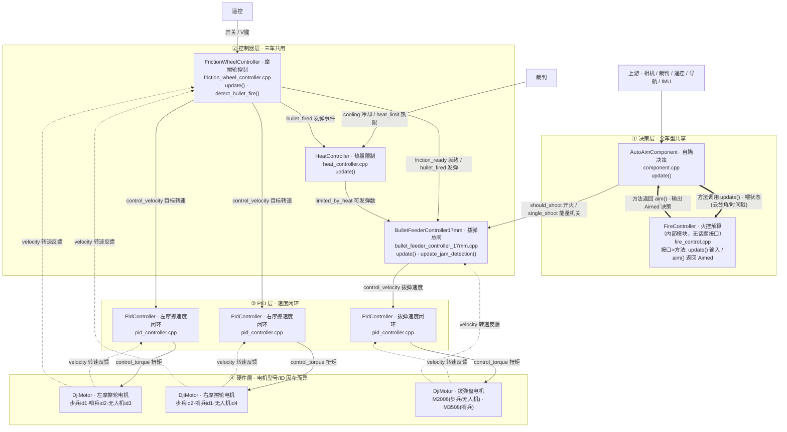
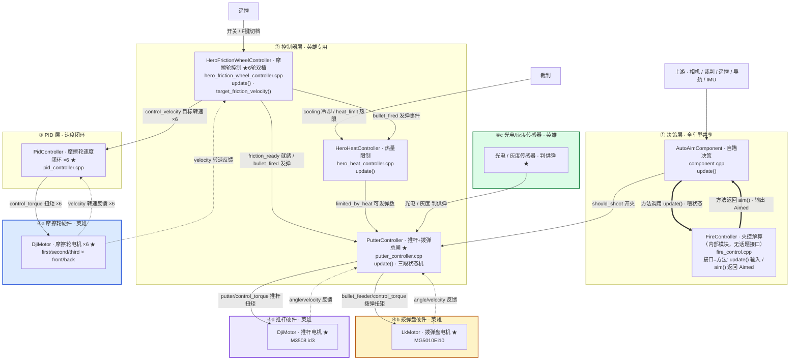
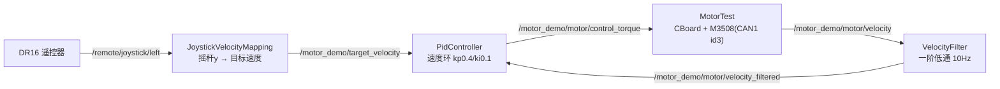

# 发射机构组件串联说明（17mm 共享体系 / omni-infantry）

> 目标：阅读有关发射机构的代码，画出发射机构的组件串联图。
> 本文以 17mm 步兵配置（`rmcs_bringup/config/omni-infantry.yaml`）为例，梳理"自瞄决策 → 发射控制器 → PID → 硬件 → 电机"的完整链路。
> 📌 **17mm 发射体系多车共享**（步兵/哨兵/无人机，控制器层同一套，仅硬件电机/CAN 不同）；**英雄是独立的 42mm 体系**。
> 两图**共享部分骨架一致**，差异以 `★` 轻标注；硬件层按兵种标注电机型号/ID 差异。
> 节点标注 **类名 · 中文概括 + 源文件 + 函数名**；连线标注**话题名（中文含义）**；`==>` 粗线表示**方法调用**（非话题接口）。

---

## 1. 总体结构：四层串联

| 层级 | 路径 | 作用 |
|---|---|---|
| ① 决策层 | `rmcs_auto_aim_v2/src/component.cpp` + `kernel/fire_control.cpp` | 判定是否开火，输出 `should_shoot`（全车型共享） |
| ② 控制器层 | `rmcs_core/src/controller/shooting/` | 摩擦轮 / 热量 / 上弹(拨弹·推杆) |
| ③ PID 层 | `rmcs_core/src/controller/pid/` | 速度指令 → 扭矩 |
| ④ 硬件层 | `rmcs_core/src/hardware/` | 扭矩 → CAN 帧 → 电机 |

**接线机制**：`register_output(topic)` 出、`register_input(topic)` 进，**话题名一致**即完成串联。

---

## 2. 组件串联图

> 📌 **说明**：`FireController`（火控）是 `AutoAimComponent` 内部的纯 C++ 类，**没有话题接口**（不 `register_input/output`）。它的输入输出靠**方法调用**：`fire->update(State)` 喂入云台/目标状态，`fire->aim(Trackable) → Aimed` 返回瞄准与开火决策（`should_shoot` 由此产生）。图中用 `==>` 粗线表示这类**方法调用**，与话题连线区分。

### 图A · 17mm 共享体系（步兵 / 哨兵 / 无人机）

### 图B · 42mm 英雄体系（★ 为与 17mm 不同处 · 硬件拆四组）

> **图例**：实线 `-->` = 话题指令/数据流；虚线 `-.->` = 话题反馈；**粗线 `==>` = 方法调用（非话题）**；`★` = 英雄与 17mm 的不同处。
> 英雄硬件拆四组（各配色）：**④a 摩擦轮**（蓝）· **④b 拨弹盘**（橙）· **④c 光电/灰度**（绿）· **④d 推杆**（紫）。
> ⚠️ **英雄两个"不接"**：`single_shoot`（rune 标志）与 `friction_profile_1_active` 都**不会**进 `PutterController`（后者仅供调试/UI 观察）——见 §2.2。
> 源码见 `mermaid/figA_17mm_shared.mmd`、`mermaid/figB_42mm_hero.mmd`。

---

## 2.1 各兵种发射机构差异速查

**控制器层**：17mm 三车（步兵/哨兵/无人机）完全一致；英雄独立。

| 部分 | 步兵 / 哨兵 / 无人机（图A） | 英雄 42mm（图B） |
|---|---|---|
| 决策层 | `AutoAimComponent`（自瞄决策）+ `FireController`（火控解算，内部模块） | 相同 |
| 摩擦轮控制器 | `FrictionWheelController`（摩擦轮控制，2 轮/单速） | `HeroFrictionWheelController` ★（摩擦轮控制，6 轮/双速档 F 键） |
| 热量控制器 | `HeatController`（热量限制） | `HeroHeatController`（热量限制） |
| 上弹控制器 | `BulletFeederController17mm`（拨弹总闸） | `PutterController` ★（推杆+拨弹总闸，三段状态机+光电/灰度） |
| PID | 3 个速度闭环 | 6 个速度闭环 + 内置拨弹/推杆 PID |
| 硬件 | 3 电机 | 8 电机 + 2 传感器（拆四组：④a 摩擦轮 / ④b 拨弹盘 / ④c 光电灰度 / ④d 推杆） |
| 自瞄输入 | `should_shoot` + `single_shoot(rune)` | **仅 `should_shoot`**（不接 rune） |

**17mm 三车硬件差异（小标注）**：

| 车型 | 左摩擦轮 | 右摩擦轮 | 拨弹盘 | 备注 |
|---|---|---|---|---|
| 步兵（全向） | M3508 id1 | M3508 id2 | M2006 id2 | `omni_infantry.cpp` |
| 步兵（变形） | M3508 id1 | M3508 id2 | M2006 id3 | `deformable-infantry-omni(-b).cpp` |
| 哨兵 | M3508 id2 | M3508 id1（反转） | **M3508 id4** | `sentry.cpp` |
| 无人机 | M3508 id3 | M3508 id4 | M2006 id1 | `flight.cpp` |

> 三者话题名**完全一致**（`/gimbal/left_friction`、`/gimbal/right_friction`、`/gimbal/bullet_feeder`），只是电机型号/ID/CAN 不同 → **控制器与电机解耦**。

---

## 2.2 接口一一对应总表（话题 ↔ 生产者 ↔ 消费者）

### 17mm 共享体系（三车相同）

| 话题 | 生产者（文件 / 类 / 成员 / 函数） | 消费者（文件 / 类 / 成员） |
|---|---|---|
| `/gimbal/auto_aim/camera_frame` | `AutoAimCapturer` | `AutoAimComponent::camera_frame`(Event) |
| `/referee/id` | `referee/status.cpp` | `AutoAimComponent::robot_id` |
| `/remote/switch/right\|left` | 遥控 `DR16` | `AutoAimComponent::rswitch/lswitch`、`FrictionWheelController::switch_right_/left_`、`BulletFeederController17mm::switch_right_/left_` |
| `/remote/mouse` | 遥控 `DR16` | `AutoAimComponent::mouse`、`BulletFeederController17mm::mouse_` |
| `/remote/keyboard` | 遥控 `DR16` | `AutoAimComponent::keyboard`、`FrictionWheelController::keyboard_`、`BulletFeederController17mm::keyboard_` |
| `/auto_aim/should_shoot` | `AutoAimComponent::should_shoot`（`fire->aim()`） | `BulletFeederController17mm::should_shoot_`、`PutterController::should_shoot_` |
| `/auto_aim/single_shoot` | `AutoAimComponent::single_shoot`（= `track_rune`） | `BulletFeederController17mm::single_shoot_`（**英雄不接**） |
| `/referee/shooter/cooling` | `referee/status.cpp` | `HeatController::shooter_cooling_`、`HeroHeatController::shooter_cooling_` |
| `/referee/shooter/heat_limit` | `referee/status.cpp` | `HeatController::shooter_heat_limit_`、`HeroHeatController::shooter_heat_limit_` |
| `/gimbal/friction_ready` | `FrictionWheelController::friction_ready_`（`update_friction_status()`） | `BulletFeederController17mm::friction_ready_`、`PutterController::friction_ready_` |
| `/gimbal/bullet_fired` | `FrictionWheelController::bullet_fired_`（`detect_bullet_fire()`） | `BulletFeederController17mm::bullet_fired_`、`HeatController::bullet_fired_`、`HeroHeatController::bullet_fired_`、`PutterController::bullet_fired_` |
| `/gimbal/control_bullet_allowance/limited_by_heat` | `HeatController::control_bullet_allowance_`（`update()`） | `BulletFeederController17mm::control_bullet_allowance_limited_by_heat_`、`PutterController::control_bullet_allowance_limited_by_heat_` |
| `/gimbal/{left,right}_friction/velocity` | `DjiMotor::velocity_output_`（`update_status()`） | `FrictionWheelController::friction_velocities_[i]`、`PidController::measurement_` |
| `/gimbal/{left,right}_friction/control_velocity` | `FrictionWheelController::friction_control_velocities_[i]` | `PidController::setpoint_` |
| `/gimbal/{left,right}_friction/control_torque` | `PidController::control_` | `DjiMotor::control_torque_` |
| `/gimbal/bullet_feeder/velocity` | `DjiMotor::velocity_output_` | `BulletFeederController17mm::bullet_feeder_velocity_`、`PidController::measurement_` |
| `/gimbal/bullet_feeder/control_velocity` | `BulletFeederController17mm::bullet_feeder_control_velocity_` | `PidController::setpoint_` |
| `/gimbal/bullet_feeder/control_torque` | `PidController::control_` | `DjiMotor(拨弹)::control_torque_` |
| `/gimbal/shooter/mode` | `BulletFeederController17mm::shoot_mode_` | 调试/上层 |

### 42mm 英雄体系（★ 英雄专属）

| 话题 | 生产者（文件 / 类 / 成员） | 消费者（文件 / 类 / 成员） |
|---|---|---|
| `/gimbal/friction_profile_1_active` ★ | `HeroFrictionWheelController::friction_profile_1_active_` | **仅供调试/UI**（`PutterController` 不接） |
| `/gimbal/{first,second,third}_{front,back}_friction/velocity` ★ | `DjiMotor::velocity_output_` | `HeroFrictionWheelController::friction_velocities_[i]`、`PidController::measurement_` |
| `/gimbal/{first,second,third}_{front,back}_friction/control_velocity` ★ | `HeroFrictionWheelController::friction_control_velocities_[i]`（`target_friction_velocity()`） | `PidController::setpoint_` |
| `/gimbal/{first,second,third}_{front,back}_friction/control_torque` ★ | `PidController::control_` | `DjiMotor::control_torque_` |
| `/gimbal/bullet_feeder/angle` / `/velocity` ★ | 硬件 `LkMotor MG5010Ei10` | `PutterController::bullet_feeder_angle_` / `bullet_feeder_velocity_` |
| `/gimbal/bullet_feeder/control_torque` ★ | `PutterController::bullet_feeder_control_torque_`（内置 `bullet_feeder_velocity_pid_`） | `LkMotor(拨弹)::control_torque_` |
| `/gimbal/putter/angle` / `/velocity` ★ | 硬件 `DjiMotor putter_motor_` | `PutterController::putter_angle_` / `putter_velocity_` |
| `/gimbal/putter/control_torque` ★ | `PutterController::putter_control_torque_`（`putter_return_velocity_pid_`） | `putter_motor_::control_torque_` |
| `/gimbal/photoelectric_sensor` / `/gimbal/grayscale_sensor` ★ | 硬件传感器 | `PutterController::photoelectric_sensor_status_` / `grayscale_sensor_status_` |
| `/gimbal/shooter/preloaded_ready` ★ | `PutterController::preloaded_ready_` | 上层/调试 |
| `/gimbal/shooter/condiction` ★ | `PutterController::shoot_condiction_` | 上层/调试 |
| `/gimbal/shoot/delay_ms` ★ | `PutterController::shoot_delay_ms_` | 调试 |
| `/shoot/heat` ★ | `HeroHeatController::shooting_heat_` | 调试 |

---

## 3. 发射流程（大白话）

**17mm**：自瞄判定开火 → 拨弹总闸确认（摩擦轮就绪 + 热量余额 + 遥控允许）→ 拨弹盘 20Hz 上弹 → 摩擦轮 660rpm 射出 → `bullet_fired` 反馈（单发停止 + 热量累计）。

**英雄 42mm**：先预装填（推杆复位 → 拨弹上膛 → 光电/灰度确认 → `PRELOADED`）→ 触发（自瞄 `should_shoot` + 手动/自动/双击）→ 推杆上膛射击 → 反馈。

---

## 4. 关键机制（函数对照）

| 机制 | 代码要点 |
|---|---|
| 软启停 | `friction_wheel_controller.cpp`：`update_friction_velocities()` |
| 发弹检测 | `friction_wheel_controller.cpp`：`detect_bullet_fire()` |
| 堵转检测 | `friction_wheel_controller.cpp`：`detect_friction_faulty()` |
| 卡弹保护 | 17mm：`update_jam_detection()`；英雄：`PutterController::update_putter_jam_detection()` |
| 热量限制 | `heat_controller.cpp` / `hero_heat_controller.cpp`：`update()` |
| 射击窗口 / 预瞄 / 退化 | `fire_control.cpp`：`ShootEvaluator::evaluate()`、`evaluate_armor()`、`get_attack_window()` |
| 双速度档 ★ | `hero_friction_wheel_controller.cpp`：`active_profile_` / `target_friction_velocity()` |
| 三段状态机 ★ | `putter_controller.cpp`：`set_preloading()/set_preloaded()/set_shooting()` |

---

## 5. 各机器人发射机构一览

| 车型 | 配置 yaml | 硬件层 | 摩擦轮 | 拨弹/上弹 |
|---|---|---|---|---|
| 步兵（全向） | `omni-infantry.yaml` | `omni_infantry.cpp` | M3508 id1/id2 | M2006 拨弹 |
| 步兵（变形） | `deformable-infantry-omni(-b).yaml` | `deformable-infantry-omni(-b).cpp` | M3508 id1/id2 | M2006 id3 拨弹 |
| 哨兵 | `sentry.yaml` | `sentry.cpp` | M3508 id2/id1 | **M3508 id4** 拨弹 |
| 无人机 | `flight.yaml` | `flight.cpp` | M3508 id3/id4 | M2006 id1 拨弹 |
| 英雄 | `steering-hero-little-six-friction.yaml` | `steering-hero-little-six-friction.cpp` | **M3508 ×6** | **LkMotor 拨弹 + M3508 推杆** |

> 哨兵拨弹用 M3508（非 M2006）但控制器仍是 `BulletFeederController17mm` → **控制器与电机解耦**。

---

## 6. 三条"暗线"

1. **`bullet_fired` 一分为多**：喂上弹控制器（单发停止）+ 热量控制器（累计热量）(+ 英雄 `PutterController`)。
2. **`friction_ready` 是总闸前提**：摩擦轮未就绪不给 allowance。
3. **`single_shoot` 是 rune 标志**（= `track_rune`），且**只有 17mm 拨弹控制器消费**，英雄 `PutterController` 不接。

---

## 7. 自验证方法

每组件看四处：`register_input`（上游）、`register_output`（下游）、`update()`（逻辑）、`get_parameter`（参数）。
**串联判定**：上家输出话题名 = 下家输入话题名，且数据类型一致。

---

# 任务二 · 用 RMCS 驱动电机（DR16 → 摇杆 → PID 速度闭环 + 低通滤波）✅ 已完成

> 任务要求：仿照现有 hardware 文件写电机控制硬件 + 接入 DR16；摇杆映射成控制速度；PID 闭环；挑合适的滤波器处理测速。

## 架构与数据流（真机验证通过）

## 交付文件（都在真实 RMCS 源码树）

| 文件 | 作用 |
|---|---|
| `rmcs_core/src/hardware/test.cpp` | 硬件组件 `MotorTest`：CBoard + 单 M3508(CAN1 id3) + DR16（主/伙伴组件解环） |
| `rmcs_core/src/controller/motor_demo/joystick_velocity_mapping.cpp` | 左摇杆 y → `/motor_demo/target_velocity` |
| `rmcs_core/src/controller/motor_demo/velocity_filter.cpp` | 测速一阶低通 → `/motor_demo/motor/velocity_filtered` |
| `rmcs_core/plugins.xml` | 注册组件 |
| `rmcs_bringup/config/test.yaml` | 完整接线 + `ValueBroadcaster` 观测 |
| `rmcs_core/src/broadcaster/value_broadcaster.cpp` | **复用仓库**：内部 double → 真实 ROS2 话题 |

## 复用了仓库哪些现成代码
- 速度环 → `PidController`；滤波 → `filter::LowPassFilter`；遥控 → `device::RemoteControl`/`Dr16`
- 方向修正 → `DjiMotor::Config::set_reversed()`（物理转向与期望相反时加）

## 实测要点/结论
- **M3508 · CAN1 · id3**；板子 **CBoard**（USB PID `0xD401`），`board_serial` = USB 序列号（非路径）
- **速度要滤、角度不滤**（角度滤波只添滞后）；速度是差分有量化噪声 → 低通
- **kp/ki/kd**：P 差多少给多少力（太小推不动）、I 消静摩擦残余、D 噪声大慎用
- 内环 kp=0.02 只有 ~0.04N·m 推不动 → 0.4 + ki0.1 跟手
- 容器无 udev：拔插后 USB 设备号变 → `bash /home/ubuntu/fix_usb.sh`
- Foxglove 看不到进程内话题 → 用 `ValueBroadcaster` 转发成 ROS2 话题（`ros2 topic echo` 也能读）

## 验证结果
真机：遥控左杆推 → 电机跟着转（速度跟杆位）；回中停；Foxglove 见 target/velocity(抖)/velocity_filtered(平滑) 联动 → 任务二完整闭环打通。
