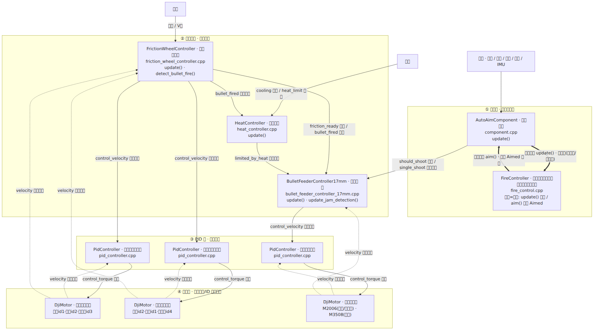
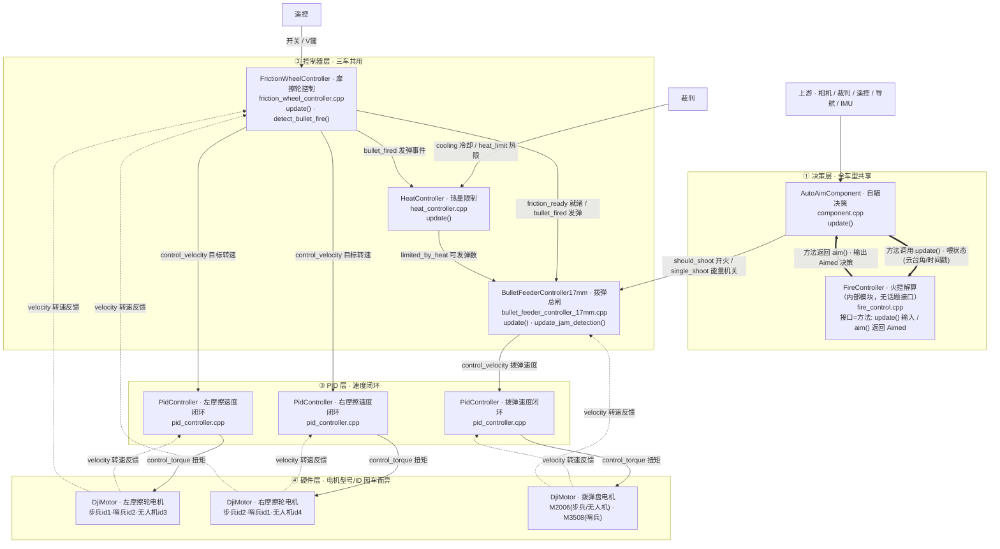
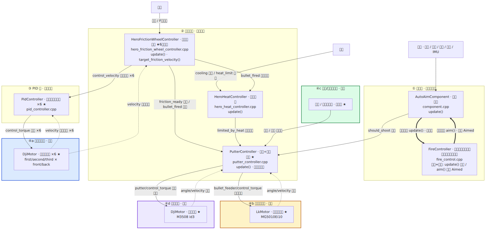
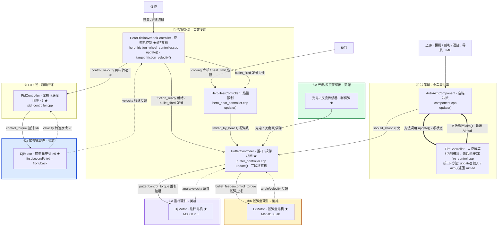
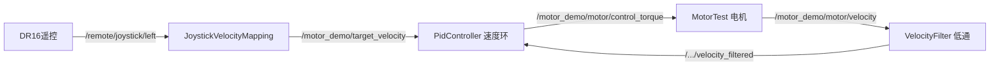
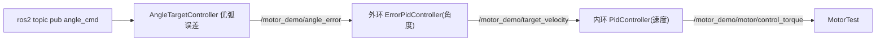

# 发射机构组件串联说明（17mm 共享体系 / omni-infantry）

> 目标：阅读有关发射机构的代码，画出发射机构的组件串联图。
> 本文以 17mm 步兵配置（`rmcs_bringup/config/omni-infantry.yaml`）为例，梳理"自瞄决策 → 发射控制器 → PID → 硬件 → 电机"的完整链路。
> 📌 **17mm 发射体系多车共享**（步兵/哨兵/无人机，控制器层同一套，仅硬件电机/CAN 不同）；**英雄是独立的 42mm 体系**。
> 两图**共享部分骨架一致**，差异以 `★` 轻标注；硬件层按兵种标注电机型号/ID 差异。
> 节点标注 **类名 · 中文概括 + 源文件 + 函数名**；连线标注**话题名（中文含义）**；`==>` 粗线表示**方法调用**（非话题接口）。

---

## 1. 总体结构：四层串联

| 层级 | 路径 | 作用 |
|---|---|---|
| ① 决策层 | `rmcs_auto_aim_v2/src/component.cpp` + `kernel/fire_control.cpp` | 判定是否开火，输出 `should_shoot`（全车型共享） |
| ② 控制器层 | `rmcs_core/src/controller/shooting/` | 摩擦轮 / 热量 / 上弹(拨弹·推杆) |
| ③ PID 层 | `rmcs_core/src/controller/pid/` | 速度指令 → 扭矩 |
| ④ 硬件层 | `rmcs_core/src/hardware/` | 扭矩 → CAN 帧 → 电机 |

**接线机制**：`register_output(topic)` 出、`register_input(topic)` 进，**话题名一致**即完成串联。

---

## 2. 组件串联图

> 📌 **说明**：`FireController`（火控）是 `AutoAimComponent` 内部的纯 C++ 类，**没有话题接口**（不 `register_input/output`）。它的输入输出靠**方法调用**：`fire->update(State)` 喂入云台/目标状态，`fire->aim(Trackable) → Aimed` 返回瞄准与开火决策（`should_shoot` 由此产生）。图中用 `==>` 粗线表示这类**方法调用**，与话题连线区分。

### 图A · 17mm 共享体系（步兵 / 哨兵 / 无人机）

### 图B · 42mm 英雄体系（★ 为与 17mm 不同处 · 硬件拆四组）

> **图例**：实线 `-->` = 话题指令/数据流；虚线 `-.->` = 话题反馈；**粗线 `==>` = 方法调用（非话题）**；`★` = 英雄与 17mm 的不同处。
> 英雄硬件拆四组（各配色）：**④a 摩擦轮**（蓝）· **④b 拨弹盘**（橙）· **④c 光电/灰度**（绿）· **④d 推杆**（紫）。
> ⚠️ **英雄两个"不接"**：`single_shoot`（rune 标志）与 `friction_profile_1_active` 都**不会**进 `PutterController`（后者仅供调试/UI 观察）——见 §2.2。
> 源码见 `mermaid/figA_17mm_shared.mmd`、`mermaid/figB_42mm_hero.mmd`。

---

## 2.1 各兵种发射机构差异速查

**控制器层**：17mm 三车（步兵/哨兵/无人机）完全一致；英雄独立。

| 部分 | 步兵 / 哨兵 / 无人机（图A） | 英雄 42mm（图B） |
|---|---|---|
| 决策层 | `AutoAimComponent`（自瞄决策）+ `FireController`（火控解算，内部模块） | 相同 |
| 摩擦轮控制器 | `FrictionWheelController`（摩擦轮控制，2 轮/单速） | `HeroFrictionWheelController` ★（摩擦轮控制，6 轮/双速档 F 键） |
| 热量控制器 | `HeatController`（热量限制） | `HeroHeatController`（热量限制） |
| 上弹控制器 | `BulletFeederController17mm`（拨弹总闸） | `PutterController` ★（推杆+拨弹总闸，三段状态机+光电/灰度） |
| PID | 3 个速度闭环 | 6 个速度闭环 + 内置拨弹/推杆 PID |
| 硬件 | 3 电机 | 8 电机 + 2 传感器（拆四组：④a 摩擦轮 / ④b 拨弹盘 / ④c 光电灰度 / ④d 推杆） |
| 自瞄输入 | `should_shoot` + `single_shoot(rune)` | **仅 `should_shoot`**（不接 rune） |

**17mm 三车硬件差异（小标注）**：

| 车型 | 左摩擦轮 | 右摩擦轮 | 拨弹盘 | 备注 |
|---|---|---|---|---|
| 步兵（全向） | M3508 id1 | M3508 id2 | M2006 id2 | `omni_infantry.cpp` |
| 步兵（变形） | M3508 id1 | M3508 id2 | M2006 id3 | `deformable-infantry-omni(-b).cpp` |
| 哨兵 | M3508 id2 | M3508 id1（反转） | **M3508 id4** | `sentry.cpp` |
| 无人机 | M3508 id3 | M3508 id4 | M2006 id1 | `flight.cpp` |

> 三者话题名**完全一致**（`/gimbal/left_friction`、`/gimbal/right_friction`、`/gimbal/bullet_feeder`），只是电机型号/ID/CAN 不同 → **控制器与电机解耦**。

---

## 2.2 接口一一对应总表（话题 ↔ 生产者 ↔ 消费者）

### 17mm 共享体系（三车相同）

| 话题 | 生产者（文件 / 类 / 成员 / 函数） | 消费者（文件 / 类 / 成员） |
|---|---|---|
| `/gimbal/auto_aim/camera_frame` | `AutoAimCapturer` | `AutoAimComponent::camera_frame`(Event) |
| `/referee/id` | `referee/status.cpp` | `AutoAimComponent::robot_id` |
| `/remote/switch/right\|left` | 遥控 `DR16` | `AutoAimComponent::rswitch/lswitch`、`FrictionWheelController::switch_right_/left_`、`BulletFeederController17mm::switch_right_/left_` |
| `/remote/mouse` | 遥控 `DR16` | `AutoAimComponent::mouse`、`BulletFeederController17mm::mouse_` |
| `/remote/keyboard` | 遥控 `DR16` | `AutoAimComponent::keyboard`、`FrictionWheelController::keyboard_`、`BulletFeederController17mm::keyboard_` |
| `/auto_aim/should_shoot` | `AutoAimComponent::should_shoot`（`fire->aim()`） | `BulletFeederController17mm::should_shoot_`、`PutterController::should_shoot_` |
| `/auto_aim/single_shoot` | `AutoAimComponent::single_shoot`（= `track_rune`） | `BulletFeederController17mm::single_shoot_`（**英雄不接**） |
| `/referee/shooter/cooling` | `referee/status.cpp` | `HeatController::shooter_cooling_`、`HeroHeatController::shooter_cooling_` |
| `/referee/shooter/heat_limit` | `referee/status.cpp` | `HeatController::shooter_heat_limit_`、`HeroHeatController::shooter_heat_limit_` |
| `/gimbal/friction_ready` | `FrictionWheelController::friction_ready_`（`update_friction_status()`） | `BulletFeederController17mm::friction_ready_`、`PutterController::friction_ready_` |
| `/gimbal/bullet_fired` | `FrictionWheelController::bullet_fired_`（`detect_bullet_fire()`） | `BulletFeederController17mm::bullet_fired_`、`HeatController::bullet_fired_`、`HeroHeatController::bullet_fired_`、`PutterController::bullet_fired_` |
| `/gimbal/control_bullet_allowance/limited_by_heat` | `HeatController::control_bullet_allowance_`（`update()`） | `BulletFeederController17mm::control_bullet_allowance_limited_by_heat_`、`PutterController::control_bullet_allowance_limited_by_heat_` |
| `/gimbal/{left,right}_friction/velocity` | `DjiMotor::velocity_output_`（`update_status()`） | `FrictionWheelController::friction_velocities_[i]`、`PidController::measurement_` |
| `/gimbal/{left,right}_friction/control_velocity` | `FrictionWheelController::friction_control_velocities_[i]` | `PidController::setpoint_` |
| `/gimbal/{left,right}_friction/control_torque` | `PidController::control_` | `DjiMotor::control_torque_` |
| `/gimbal/bullet_feeder/velocity` | `DjiMotor::velocity_output_` | `BulletFeederController17mm::bullet_feeder_velocity_`、`PidController::measurement_` |
| `/gimbal/bullet_feeder/control_velocity` | `BulletFeederController17mm::bullet_feeder_control_velocity_` | `PidController::setpoint_` |
| `/gimbal/bullet_feeder/control_torque` | `PidController::control_` | `DjiMotor(拨弹)::control_torque_` |
| `/gimbal/shooter/mode` | `BulletFeederController17mm::shoot_mode_` | 调试/上层 |

### 42mm 英雄体系（★ 英雄专属）

| 话题 | 生产者（文件 / 类 / 成员） | 消费者（文件 / 类 / 成员） |
|---|---|---|
| `/gimbal/friction_profile_1_active` ★ | `HeroFrictionWheelController::friction_profile_1_active_` | **仅供调试/UI**（`PutterController` 不接） |
| `/gimbal/{first,second,third}_{front,back}_friction/velocity` ★ | `DjiMotor::velocity_output_` | `HeroFrictionWheelController::friction_velocities_[i]`、`PidController::measurement_` |
| `/gimbal/{first,second,third}_{front,back}_friction/control_velocity` ★ | `HeroFrictionWheelController::friction_control_velocities_[i]`（`target_friction_velocity()`） | `PidController::setpoint_` |
| `/gimbal/{first,second,third}_{front,back}_friction/control_torque` ★ | `PidController::control_` | `DjiMotor::control_torque_` |
| `/gimbal/bullet_feeder/angle` / `/velocity` ★ | 硬件 `LkMotor MG5010Ei10` | `PutterController::bullet_feeder_angle_` / `bullet_feeder_velocity_` |
| `/gimbal/bullet_feeder/control_torque` ★ | `PutterController::bullet_feeder_control_torque_`（内置 `bullet_feeder_velocity_pid_`） | `LkMotor(拨弹)::control_torque_` |
| `/gimbal/putter/angle` / `/velocity` ★ | 硬件 `DjiMotor putter_motor_` | `PutterController::putter_angle_` / `putter_velocity_` |
| `/gimbal/putter/control_torque` ★ | `PutterController::putter_control_torque_`（`putter_return_velocity_pid_`） | `putter_motor_::control_torque_` |
| `/gimbal/photoelectric_sensor` / `/gimbal/grayscale_sensor` ★ | 硬件传感器 | `PutterController::photoelectric_sensor_status_` / `grayscale_sensor_status_` |
| `/gimbal/shooter/preloaded_ready` ★ | `PutterController::preloaded_ready_` | 上层/调试 |
| `/gimbal/shooter/condiction` ★ | `PutterController::shoot_condiction_` | 上层/调试 |
| `/gimbal/shoot/delay_ms` ★ | `PutterController::shoot_delay_ms_` | 调试 |
| `/shoot/heat` ★ | `HeroHeatController::shooting_heat_` | 调试 |

---

## 3. 发射流程（大白话）

**17mm**：自瞄判定开火 → 拨弹总闸确认（摩擦轮就绪 + 热量余额 + 遥控允许）→ 拨弹盘 20Hz 上弹 → 摩擦轮 660rpm 射出 → `bullet_fired` 反馈（单发停止 + 热量累计）。

**英雄 42mm**：先预装填（推杆复位 → 拨弹上膛 → 光电/灰度确认 → `PRELOADED`）→ 触发（自瞄 `should_shoot` + 手动/自动/双击）→ 推杆上膛射击 → 反馈。

---

## 4. 关键机制（函数对照）

| 机制 | 代码要点 |
|---|---|
| 软启停 | `friction_wheel_controller.cpp`：`update_friction_velocities()` |
| 发弹检测 | `friction_wheel_controller.cpp`：`detect_bullet_fire()` |
| 堵转检测 | `friction_wheel_controller.cpp`：`detect_friction_faulty()` |
| 卡弹保护 | 17mm：`update_jam_detection()`；英雄：`PutterController::update_putter_jam_detection()` |
| 热量限制 | `heat_controller.cpp` / `hero_heat_controller.cpp`：`update()` |
| 射击窗口 / 预瞄 / 退化 | `fire_control.cpp`：`ShootEvaluator::evaluate()`、`evaluate_armor()`、`get_attack_window()` |
| 双速度档 ★ | `hero_friction_wheel_controller.cpp`：`active_profile_` / `target_friction_velocity()` |
| 三段状态机 ★ | `putter_controller.cpp`：`set_preloading()/set_preloaded()/set_shooting()` |

---

## 5. 各机器人发射机构一览

| 车型 | 配置 yaml | 硬件层 | 摩擦轮 | 拨弹/上弹 |
|---|---|---|---|---|
| 步兵（全向） | `omni-infantry.yaml` | `omni_infantry.cpp` | M3508 id1/id2 | M2006 拨弹 |
| 步兵（变形） | `deformable-infantry-omni(-b).yaml` | `deformable-infantry-omni(-b).cpp` | M3508 id1/id2 | M2006 id3 拨弹 |
| 哨兵 | `sentry.yaml` | `sentry.cpp` | M3508 id2/id1 | **M3508 id4** 拨弹 |
| 无人机 | `flight.yaml` | `flight.cpp` | M3508 id3/id4 | M2006 id1 拨弹 |
| 英雄 | `steering-hero-little-six-friction.yaml` | `steering-hero-little-six-friction.cpp` | **M3508 ×6** | **LkMotor 拨弹 + M3508 推杆** |

> 哨兵拨弹用 M3508（非 M2006）但控制器仍是 `BulletFeederController17mm` → **控制器与电机解耦**。

---

## 6. 三条"暗线"

1. **`bullet_fired` 一分为多**：喂上弹控制器（单发停止）+ 热量控制器（累计热量）(+ 英雄 `PutterController`)。
2. **`friction_ready` 是总闸前提**：摩擦轮未就绪不给 allowance。
3. **`single_shoot` 是 rune 标志**（= `track_rune`），且**只有 17mm 拨弹控制器消费**，英雄 `PutterController` 不接。

---

## 7. 自验证方法

每组件看四处：`register_input`（上游）、`register_output`（下游）、`update()`（逻辑）、`get_parameter`（参数）。
**串联判定**：上家输出话题名 = 下家输入话题名，且数据类型一致。

---

---

# 电机驱动任务教程（任务二：速度闭环 → 任务三：双环控角度）✅ 均已完成

> 一套代码从"摇杆推着电机转"做到"发个角度电机走优弧到位"。适合当教程读。
> 改动范围：**官方库只动 `plugins.xml`（登记新组件，框架必需）**；其余都是自己新增的文件，全部列在下面。

## 0. 先懂 3 个概念（看懂所有代码的前提）

1. **一个组件 = 一个 C++ 类**（继承 `rmcs_executor::Component`），executor 每 1ms 调它的 `update()`。
2. **组件之间靠"话题"连接**（`register_output` 发布 / `register_input` 订阅，同名即连通）。⚠️ 这些是**进程内**话题，不在 ROS2 网络里，`ros2 topic` / Foxglove 默认看不到。
3. **复用**：RMCS 仓库现成的东西（PID、滤波器、遥控、广播器）直接拿来接线，别重写。

## 1. 我新增/改动了哪些文件（全清单）

| 文件 | 新增/改动 | 是什么 | 属于 |
|---|---|---|---|
| `rmcs_core/src/hardware/test.cpp` | 新增(我方) | 硬件组件 `MotorTest`：**CBoard + M3508(CAN1,id3) + DR16**。仿现有车文件骨架（主/伙伴组件解环） | 任务二 + 任务三(加多圈) |
| `rmcs_core/src/controller/motor_demo/joystick_velocity_mapping.cpp` | 新增(我方) | 组件：左摇杆 y → `/motor_demo/target_velocity`（摇杆断连输出 0，安全） | 任务二 |
| `rmcs_core/src/controller/motor_demo/velocity_filter.cpp` | 新增(我方) | 组件：测速 **中值+低通串联** → `/motor_demo/motor/velocity_filtered`（中值砍量化尖刺，低通平滑） | 任务二 |
| `rmcs_core/src/filter/median_filter.hpp` | 新增(我方) | 滤波器：**中值滤波**（滑动窗口取排序中值），专砍偶发尖刺/离群点；参数 `median_window`(奇数) | 任务二扩展 |
| `rmcs_core/src/controller/motor_demo/angle_target_controller.cpp` | 新增(我方) | 组件：订阅外部 `/motor_demo/angle_cmd` → 算**优弧**误差 `/motor_demo/angle_error`，并把目标角广播成 `/motor_demo/target_angle` 供叠图比对 | 任务三(经典版) |
| `rmcs_core/src/controller/motor_demo/command_mode_controller.cpp` | 新增(我方) | 组件 `CommandModeController`：yaml `mode` 一键切 **angle/velocity/torque** + 设固定目标；angle 内置外环P；velocity 带**波形测试接口** `velocity_waveform`(none/square/sine)；可被外部 cmd topic 覆盖 | 扩展(模式切换) |
| `rmcs_bringup/config/test.yaml` | 新增(我方) | **总接线**：上面组件 + 现成 PID 串起来；含三模式切换段 `motor_command_mode` 与 `ValueBroadcaster` 观测 | 任务二/三/模式切换 |
| `rmcs_core/plugins.xml` | 改动(**官方唯一**) | 登记新组件（RMCS 加载必需） | 任务二/三 |

**复用的现成组件**（没重写）：`PidController`/`ErrorPidController`（PID）、`filter::LowPassFilter`（滤波）、`device::RemoteControl`/`Dr16`（遥控）、`broadcaster::ValueBroadcaster`（内部→ROS2 话题，给 Foxglove/`ros2 topic` 用）。

## 2. 每个新增组件逐个讲

### 2.1 `test.cpp` → `MotorTest`（硬件层）
- 干什么：跟真硬件说话。构造里 `configure(M3508, 3)` 配电机；`RemoteControl + register_dr16` 接遥控；`CBoard(串口)` 打开板子。
- 拆"主组件 + 伙伴组件"：电机的**输出**(angle/velocity)注册在主组件、**输入**(control_torque)注册在伙伴组件 → 让 executor 拓扑排成"收→算→发"、避免和 PID 形成环（这是 RMCS 硬件文件固定套路，抄 omni_infantry.cpp 即可）。
- 回调：`can_receive` 收 CAN 反馈按 id(0x203) 存；`uart_receive`(DBUS) 喂 DR16。

### 2.2 `joystick_velocity_mapping.cpp`（任务二软件①）
- 读 `/remote/joystick/left`（Eigen::Vector2d，来自硬件 RemoteControl）。
- 输出 `目标速度 = 摇杆y × max_velocity` → `/motor_demo/target_velocity`。
- 关键：`joystick_.ready()` 判空，遥控没连就输出 0（安全）。

### 2.3 `velocity_filter.cpp`（任务二软件②）
- 读原始测速 → 一阶低通 `LowPassFilter` → 输出滤波后转速给 PID 当反馈。
- 为什么滤速度不滤角度：测速是"位置差分"→ 量化噪声大；角度是绝对读数很干净，滤了反而加滞后。

### 2.4 `angle_target_controller.cpp`（任务三软件）
- 订阅外部 ROS2 话题 `/motor_demo/angle_cmd`（`std_msgs/Float64`，单位弧度）→ 满足"ros2 topic 发布角度值"。
- 读当前多圈角 `/motor_demo/motor/angle`。
- **走优弧**：`误差 = std::remainder(目标 − 当前, 2π)`，结果落在 [−π,π)，永远选短弧方向。
- **锁当前角**：没收到指令前目标=当前角 → 上电不乱转。
- **出 `target_angle`**：把目标角也注册成输出并广播（多圈连续、不卷绕），Foxglove 里与 `angle` 叠图即可直观看到“追没追上、误差多少”。

## 3. 任务二：速度闭环（摇杆 → 电机转）

- 启动：`cd rmcs_ws && source install/setup.bash && ros2 launch rmcs_bringup rmcs.launch.py robot:=test`
- 验证：推左杆电机跟转、回中停；Foxglove 看 velocity(抖)/velocity_filtered(平滑)/target_velocity(杆)。
- 要点：内环 kp 太小推不动（0.02→0.4+ki0.1 跟手）；转向反就 `.set_reversed()`。

## 4. 任务三：双环控角度（发角度 → 走优弧到位）

- 外环吃角度误差、出"目标速度"；内环(任务二的)追目标速度 → 串级更稳。
- **必须先开 `enable_multi_turn_angle()`**：单圈角度 2π↔0 会跳变，角度环会追着绕圈。
- 验证：启动锁当前角不动 → `ros2 topic pub -1 /motor_demo/angle_cmd std_msgs/msg/Float64 "{data: 1.5}"` → 走优弧到位停；再发 `-1.5` 走短弧回。
- Foxglove 对比：订阅 `target_angle` + `angle` 两条叠一起，看实际角追目标角；`angle_error` 看收敛残余。

## 5. 调参速查（都在 test.yaml，改完重编译重启动）

| 现象 | 调哪个 | 方向 |
|---|---|---|
| 推不动/到位不了 | 内环 `kp`、`ki` | kp↑（但会抖）、ki↑（消静摩擦） |
| 抖动/来回 | `kp`↓、滤波 `cutoff`↓ | 降增益/压高频 |
| 到位冲过头 | 内环 `kd`↑一点 | 加阻尼 |
| 大角度想更优雅 | 外环 `output_max` 限速 / 后续加 S 形规划 | — |
| 扭矩不够 | 内环 `output_min/max` 放大(±1→更大) | 别超额定 |

## 6. 踩过的坑（checklist）
1. 单圈角度不开多圈 → 绕圈 ❌ → `enable_multi_turn_angle()`
2. 内环积分限幅设 ±0 → ki 白设 ❌ → 放开(±0.5)
3. 转向反 → `.set_reversed()`
4. Foxglove 看进程内话题看不到 → 加 `ValueBroadcaster` 转发成 ROS2 话题
5. 容器无 udev，USB 拔插后设备号变 → `bash /home/ubuntu/fix_usb.sh`
6. `plugins.xml` 是加载组件的唯一入口，加了组件必须去登记
7. executor 报 `Serial number read failed / No compatible device`，或板子直接不枚举 → **断电重启板子主电源**（CBoard 是外部供电，只拔 USB 不会让 MCU 复位，USB 协议栈会一直卡死；断电等 10s 再上电 → 重插 USB → `fix_usb.sh`）
8. Foxglove 端口(8765)开着但看不到话题 → 旧 foxglove 进程 DDS 会话已脱节（进程在但不参与当前 ROS2 图），干净重启 foxglove_bridge 即可
9. 频繁 `kill -9` 重启 executor（尤其电机在跑时）→ 板子 CAN 会话卡死：executor 正常、指令在发、但电机不动且力矩反馈 0 → **优先用 Ctrl+C 优雅停机**再重启一般自愈；不行再断电重启板子
10. torque(直驱)模式是开环：给空载电机恒定力矩会一直加速到飞转 ⚠️ → 空载别用大值，玩小力矩+手随时能断电；默认配置已改回 angle 闭环(安全)

## 7. 验证结果（真机）
- 任务二：摇杆推 → 电机跟转、回中停、滤波平滑 → 通 ✅
- 任务三：启动锁当前角不动 → `ros2 topic pub -1 /motor_demo/angle_cmd ..."{data: 1.5}"` → 走优弧到位、误差收敛 → 再发 -2.0/0.5/3.0 连续跟踪 → 通 ✅
- 已知现象：外环纯 P(ki=0) + 电机静摩擦 → 到位后留 ~0.1 rad 稳态误差（正常，P 控制特性）；要收紧就给外环加 ki(如 0.1) + 积分限幅 ±1（需重启 executor）

## 8. 扩展：yaml 一键切 角度/速度/力矩 三模式

### 8.1 怎么用（全在 `test.yaml`，改完重启 executor）
- 切模式：`motor_command_mode` 段把 `mode:` 改成 `angle` / `velocity` / `torque`
- 设目标：同段改 `angle`(rad) / `velocity`(rad/s) / `torque`(N·m)
- ★torque 模式：`components` 里【速度PID】那行要注释掉（直驱绕过PID，否则两组件抢写 `control_torque` 启动报错）
- 外部覆盖（yaml 值=开机默认，发 topic 即实时改目标）：`/motor_demo/angle_cmd`、`/motor_demo/velocity_cmd`、`/motor_demo/torque_cmd`
- Foxglove 叠图：angle 模式把 `forward_list` 里 `target_angle` / `angle_error` 两行取消注释

### 8.2 原理
`CommandModeController` 构造时按 `mode` 只注册该模式需要的输出：
- `angle`：读当前角 → 优弧误差 → 内置外环P(`angle_kp`) → `target_velocity`(交内环PID) ＋ 广播 `target_angle`/`angle_error`
  - ℹ️ 广播的 `target_angle` 是**抬升值**(当前角+卷绕误差，即电机实际要去的连续位置)：多圈累计后 Foxglove 里能与 `angle` 重合，避免“差一整圈 2π 看着像没追上”的假象；真正的指令目标仍以你发的 `angle_cmd`/yaml `angle` 为准
- `velocity`：直接出固定 `target_velocity`(交内环PID)
- `torque`：直接出 `control_torque`(绕过所有PID，**开环**，无速度限制)

### 8.3 真机验证（2026-09-05）
- velocity：设 3.0 → 滤波测速稳在 2.9996 ✅；`velocity_cmd=-1/0` 实时反转/停机 ✅
- angle：设 1.0 → 电机走优弧到位(残余~0.11，同经典P) ✅
- torque：设 0.5 → 电机持续加速(空载飞转=正常开环表现) ✅；`torque_cmd=0` 停机 ✅
- ⚠️ 安全默认 = angle(闭环锁位不飞转)；torque 需人为注释速度PID + 小力矩 + 手随时断电
